# Nexus Wealth

> AI-powered agentic advisory platform — built on LangGraph + FastAPI + Vanilla JS.  
> Demonstrates a full 10-step autonomous wealth advisory pipeline with Human-in-the-Loop review, real-time SSE streaming, and a premium advisor dashboard.

---

## Architecture

```mermaid
graph TB
    subgraph "Frontend — Advisor Dashboard"
        UI["Advisor Dashboard UI (HTML / JS / CSS)"]
    end

    subgraph "Backend — FastAPI"
        API["REST API + SSE (port 8000)"]
        DB["SQLite · Client 360 mock data"]
    end

    subgraph "LangGraph Pipeline"
        S1["1. Client Profile Ingestion"]
        S2["2. Outside Asset Detection ★"]
        S3["3. AI Risk Assessment"]
        S4a["4a. Tax Agent"]
        S4b["4b. Portfolio Agent"]
        S4c["4c. Alt Assets Agent"]
        S4d["4d. Estate & Legacy Agent ★"]
        S5["5. Compliance Guardrails"]
        S6["6. Advisor Review (HITL)"]
        S7["7. Sync to Citi Sky"]
        S8["8. Continuous Monitoring"]
    end

    UI --> API
    API --> DB
    API --> S1
    S1 --> S2 --> S3
    S3 --> S4a & S4b & S4c & S4d
    S4a & S4b & S4c & S4d --> S5 --> S6 --> S7 --> S8
    S6 -.-> UI
```



---

## Prerequisites

| Requirement | Version |
|---|---|
| Python | 3.9 or newer |
| pip | bundled with Python |

> No Node.js or npm needed — the frontend is plain HTML/CSS/JS served by Python's built-in HTTP server.

---

## Quick Start

### Windows

```bat
run_servers.bat
```

Double-click `run_servers.bat` (or run it in a terminal).  
It will start the backend, frontend server, and open the browser automatically.

### macOS / Linux

```bash
chmod +x run_servers.sh
./run_servers.sh
```

The script creates a virtual environment, installs dependencies, and opens the browser automatically.

---

## Manual Setup

If you prefer to run the servers individually:

### 1 · Backend

```bash
cd backend

# Create and activate a virtual environment (recommended)
python -m venv .venv

# Windows
.venv\Scripts\activate

# macOS / Linux
source .venv/bin/activate

# Install dependencies
pip install -r requirements.txt

# Start the API server (seeds the database automatically on first run)
uvicorn main:app --reload --port 8000
```

### 2 · Frontend

In a second terminal, serve the static files:

```bash
# Python built-in server (cross-platform)
python -m http.server 3000 --directory frontend

# Or with Node (optional)
npx serve frontend -p 3000
```

Then open **http://127.0.0.1:3000/index.html** in your browser.

---

## Running a Demo

1. Open the Advisor Dashboard at `http://127.0.0.1:3000/index.html`.
2. Select a client from the **Client Roster** (e.g., *Sarah Chen*).
3. Review the Client 360 profile, portfolio allocation chart, and outside assets.
4. Click **Run Pipeline** to trigger the 10-step agentic execution engine.
5. Watch the real-time SSE progress as agents execute in sequence and in parallel.
6. Once complete, review generated **Tax**, **Portfolio**, **Alt Assets**, and **Estate** recommendations.
7. Check the **Compliance & Approval** panel — human sign-off is required (HITL).
8. Click **Approve & Deliver** to finalise the recommendation package.
9. View the full reasoning chain in the **Audit Trail**.

---

## Features

| Feature | Description |
|---|---|
| **Outside Asset Detection** | Identifies accounts at competing institutions and generates migration strategies |
| **AI Risk Assessment** | Composite risk score based on tolerance, age, and portfolio diversification |
| **Tax Optimization** | Tax-loss harvesting candidates, Roth conversion analysis, asset location improvements |
| **Portfolio Rebalancing** | Drift analysis from target allocations with trade recommendations |
| **Alt Assets Agent** | Private equity, real estate, and commodities diversification opportunities |
| **Estate & Legacy Agent** | Trust structures, 529 plans, and charitable giving (DAF) analysis |
| **Compliance Guardrails** | Validates against SEC/FINRA concentration limits, age suitability, risk alignment |
| **Human-in-the-Loop** | Mandatory advisor review before final client delivery |
| **Real-time SSE Streaming** | Live pipeline progress updates pushed from the backend |
| **Light / Dark Mode** | Theme toggle persisted in localStorage |
| **In-App Help Center** | Plain-language glossary for non-finance users |

---

## Project Structure

```
nexus_wealth/
├── backend/
│   ├── agents/                 # Individual LangGraph agent modules
│   │   ├── client_ingestion.py
│   │   ├── outside_asset_detection.py
│   │   ├── risk_assessment.py
│   │   ├── tax_agent.py
│   │   ├── portfolio_agent.py
│   │   ├── alt_assets_agent.py
│   │   ├── estate_agent.py
│   │   ├── compliance.py
│   │   ├── advisor_review.py
│   │   ├── client_delivery.py
│   │   └── monitoring.py
│   ├── graph.py                # LangGraph pipeline definition
│   ├── main.py                 # FastAPI app + SSE endpoints
│   ├── db.py                   # SQLite client 360 data layer
│   ├── seed_data.py            # Mock client data seeder
│   ├── requirements.txt
│   └── .env.example            # Copy to .env if you add real API keys
├── frontend/
│   ├── index.html              # Advisor dashboard (main app)
│   ├── dashboard.js            # All frontend logic
│   ├── index.css               # Design system + component styles
│   ├── app.js                  # (legacy entry, superseded by dashboard.js)
│   └── landing.html            # (optional landing page)
├── run_servers.bat             # Windows one-click launcher
├── run_servers.sh              # macOS / Linux one-click launcher
└── README.md
```

---

## Environment Variables

Copy `backend/.env.example` to `backend/.env` and fill in any keys if needed:

```env
# Optional — only required if you wire in real LLM calls
OPENAI_API_KEY=your_key_here
```

The POC runs fully offline with deterministic mock agents — no API keys are required for the demo.
